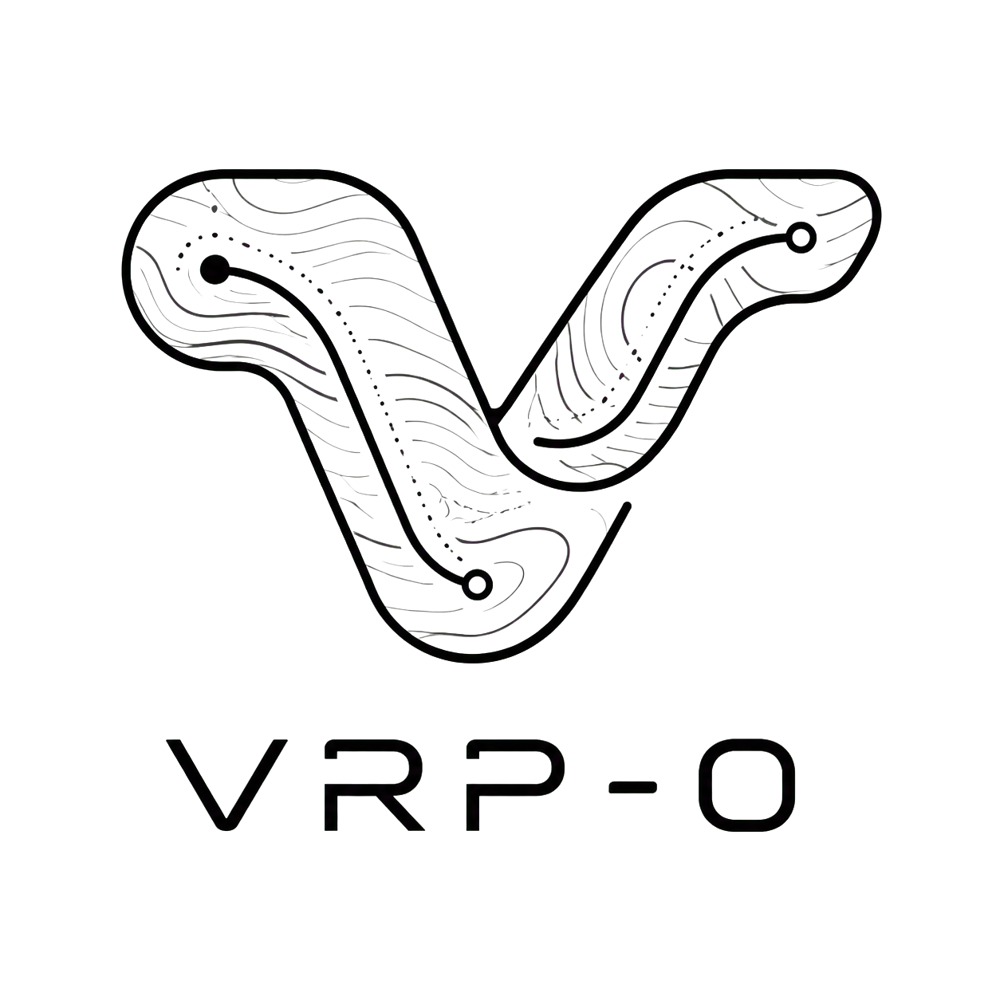

<p align="center">
  
</p>

# vrp-0

`vrp-0` 是面向复杂现场服务与车辆调度的开源规划引擎。它以 Quarkus 构建轻量服务底座，以 OptaPlanner 编排多仓、多车型、工程师技能、工单关联与时间窗等业务约束，在持续搜索中生成可解释、可追踪的调度方案。REST API、HTTP MCP 与静态控制台共享同一运行状态，贯通场景建模、矩阵构建、求解观测、甘特排程与地图复盘，为智能体接入和业务系统集成提供一条完整、可嵌入的优化链路。

[](./docs/design/VRP-0-web-demo-12s.mp4)

[查看演示视频](./docs/design/VRP-0-web-demo-12s.mp4)。

## Features

- **统一场景状态**：REST、MCP 与控制台操作同一份当前场景和任务数据，避免多入口带来的状态漂移。
- **复杂约束求解**：支持多仓、多车型、工程师技能、工单关联、时间窗与成本参数，在持续搜索中生成可执行的调度方案。
- **全过程可观测**：从矩阵构建、任务历史和得分演进，到 Gantt 排程、路线地图与一张图播放，完整呈现求解过程与结果。
- **双地图能力**：可按环境切换 AMap 或 HERE，覆盖地址解析、POI、路径规划与浏览器地图，并保留场景求解时的地图上下文。
- **智能体原生接入**：同时提供 REST API 与 HTTP MCP Tools，配套鉴权、Origin 白名单和运行状态管理。
- **可嵌入 Web 控制台**：单一 `scenario.html` Web Component 统一承载场景维护、任务求解和结果分析，静态资源完全本地化。
- **工程化交付**：内置 OpenAPI、Swagger UI、Metrics、Docker 与分层测试体系，便于集成、验证和部署。

## Tech Stack

- Java 21
- Gradle
- Quarkus
- OptaPlanner
- RESTEasy Reactive
- Alpine.js + TailwindCSS v4

## Quick Start

### Requirements

- JDK 21
- Bash、Docker 和 Docker Compose v2（使用 `scripts/docker-service.sh` 时需要；本地开发模式不需要）
- Docker（使用容器完成 native build 时需要）

### 使用 Docker Compose 启动

在仓库根目录执行以下命令；也可以直接在 VS Code 集成终端中执行：

```bash
./scripts/docker-service.sh start
```

该命令先构建 Quarkus JVM 产物，再构建并后台启动 Docker Compose 服务。服务启动完成后访问 `http://localhost:8080/`。

其他常用命令：

```bash
./scripts/docker-service.sh status
./scripts/docker-service.sh logs
./scripts/docker-service.sh restart
./scripts/docker-service.sh stop
```

如需启用地图或 MCP，在启动前复制 `.env.example` 为 `.env`，填写所需密钥并显式打开对应开关；`.env` 不应提交到仓库。

### VS Code（可选）

VS Code 及其扩展都不是启动项目的必要条件。使用 VS Code 开发时，可按需安装以下扩展：

| 扩展 | 扩展 ID | 建议级别 | 用途 |
| --- | --- | --- | --- |
| Extension Pack for Java | `vscjava.vscode-java-pack` | 建议安装 | Java 编辑、运行、调试和测试 |
| Gradle for Java | `vscjava.vscode-gradle` | 可选 | 导入 Gradle 项目并运行 Gradle Task |
| Quarkus | `redhat.vscode-quarkus` | 可选 | Quarkus 配置提示及开发模式调试 |

可以在扩展市场搜索扩展 ID，或在终端中安装：

```bash
code --install-extension vscjava.vscode-java-pack
code --install-extension vscjava.vscode-gradle
code --install-extension redhat.vscode-quarkus
```

确认 `JAVA_HOME` 指向 JDK 21；安装了 Java 扩展时，可在命令面板执行 `Java: Configure Java Runtime`，确认当前项目使用 JDK 21。需要本地开发调试时，可通过以下任一方式启动：

- 安装 Quarkus 扩展后，在命令面板执行 `Quarkus: Debug current Quarkus project`，以开发模式启动并自动连接调试器。
- 在 VS Code 集成终端执行 `./gradlew quarkusDev`（Windows 使用 `.\gradlew.bat quarkusDev`）。

### Run In Dev Mode

```bash
./gradlew quarkusDev
```

启动后默认可访问：

- App: `http://localhost:8080/`
- Swagger UI: `http://localhost:8080/q/swagger-ui/`
- Metrics: `http://localhost:8080/q/metrics`

### Managed Local Debug Run

`scripts/devctl.sh` uses the existing `quarkusRunDebug` Gradle task through a dedicated non-daemon Gradle process. It runs the application in the background, enables the default JDWP debugger port `5005`, and reloads the repository-root `.env` on every `start` and `restart`.

The Gradle child process receives a clean project runtime environment: only the bootstrap variables `HOME`, `PATH` and optional `JAVA_HOME` are retained, then non-commented values from `.env` are added. Variables from the shell that are absent from `.env` are not inherited. Therefore, when `.env` omits `MAP_PROVIDER`, the application uses its `application.properties` default (`AMAP`).

```bash
scripts/devctl.sh start
scripts/devctl.sh restart
scripts/devctl.sh stop
```

The script records its PID and log in `build/local/quarkusRunDebug.pid` and `build/local/quarkusRunDebug.log`. It only manages processes started by this script.

### Build Runnable Artifact

```bash
./gradlew quarkusBuild -x test
java -jar build/quarkus-app/quarkus-run.jar
```

## Demo

### Web Console Demo

仓库内置了公开 demo 场景：`scenarios/public-demo/scen-1.json`。用于演示真实搜索过程得分变化的独立样例为 `scenarios/public-demo/beijing-score-progress.json`；用于演示 HERE 在不规则路网下进行多仓、多工程师、多工单复杂派单的样例为 `scenarios/public-demo/here-nz-auckland-complex.json`。后两者都是控制台“导入请求 JSON”格式，导入后会在下一次保存或求解时替换本地场景，并分别使用 MANHATTAN、ROUTING 矩阵生成路线。

### Import Demo Scenario

```bash
curl -X PUT "http://localhost:8080/scenario?build=true&matrix_mode=MANHATTAN" \
  -H "Content-Type: application/json" \
  --data-binary @scenarios/public-demo/scen-1.json
```

### Verify Scenario State

```bash
curl "http://localhost:8080/scenario/available_agents"
curl "http://localhost:8080/scenario"
```

### Console Pages

控制台首页为 `http://localhost:8080/`，主要页面包括：

- `#/scenario`：当前场景详情
- `#/solver-jobs`：求解任务列表，可按状态、创建时间和求解参数筛选
- `#/solver-job`：隐藏路由，查看指定求解任务详情
- `#/solver-map`：隐藏路由，查看指定求解任务一张图
- `#/quota`：地图接口配额配置
- `GET /map_context`：当前图商的浏览器 SDK、key、坐标系与启用状态
- `#/mcp`：MCP 接入说明与状态页

### Scenario UI 组件产物

Gateway 与 Engine Host 共用 `src/main/resources/META-INF/resources/static/scenario.html`。它是唯一的 Scenario UI 交付物，包含创建页的中心工作区、创建求解抽屉、结果页和内部 Gantt / 地图 / 一张图切换；组件只使用 Host 注入的 `context`、四个 actions 和 `CustomEvent`，不使用 iframe 或 `postMessage`。Engine 顶部工具栏、保存/生成矩阵/删除、复制导入、右侧概览/趋势和独立任务列表保留在本地页面资源中，不会打包给 Gateway。

`scenario.html` 内的 `data-scenario-ui-manifest` 只声明 Host 运行时公共依赖 ID 与版本：Material Symbols Rounded 和结果视图 Plotly Basic 由 Engine/Gateway 各自的 `assets/scenario-runtime/registry.json` 及版本化静态资源提供。Tailwind 仅在组件构建期使用：构建将 Tailwind 编译结果与业务 CSS 一并内联到 `scenario.html`，Host 不提供或加载私有 Tailwind CSS。`scenario.html` 是唯一需提交、可部署的组件产物；`scenario-tailwind.compiled.css`、`scenario-business.compiled.css` 等组件专用中间文件不会生成或提交。构建会校验 registry 文件 hash，并拒绝没有 manifest、内联字体或内联 Plotly 的产物。

组件构建以现有 `pages/scenario-detail.html`、`pages/solver-job-detail.html`、`pages/solver-job-map.html` 及其 Alpine 模块为源码，因此组件化不会另起一套页面样式或交互。修改这些页面、对应模块或组件样式后，在静态资源目录执行：

```bash
npm run sync:vendor
npm run build:css
npm run build:host-dependencies
npm run build:scenario
npm run verify:scenario
```

构建脚本拒绝普通脚本、外部脚本和多个 `<script export>`。`docs/openapi.yaml` 是 Engine REST API 的发布契约，其中 `GET /solver_job/list` 支持状态、创建时间和求解参数的可选筛选。

任务详情中的 `solution_metrics_list` 同时承载求解过程：`BEST_SOLUTION` 仅在得分严格改善时产生，`SEARCH_SAMPLE` 最多每秒记录一次当前搜索得分和历史最优得分，`FINAL_SOLUTION` 的时间为搜索结束时刻。结果页只展示过程曲线，不展示评分或 Move 活动摘要；历史归档缺少搜索快照时组件保持兼容展示，不合成过程点。

可用以下外部集成测试对该 demo 连续执行三次 10 秒真实求解，并断言每次都有至少两次严格 Best 改善：

```bash
./gradlew externalTest --tests 'one.rewind.xforce.vehicle_routing.remote.test.BeijingScoreProgressDemoSolverTest' -Dvrp.external.enabled=true
```

## Configuration

默认配置位于 [src/main/resources/application.properties](./src/main/resources/application.properties)。

常用配置项：

- `vrp.mcp.enabled`
- `vrp.mcp.path`
- `vrp.mcp.auth.token`
- `amap.enabled`
- `amap.app-key`
- `amap.address-resolver-url`
- `map.provider`（`AMAP` 或 `HERE`，单个运行实例只选择其一）
- `here.api-key`
- `here.qps`、`here.quota`、`here.interval`、`here.wait-timeout`
- `here.matrix-routing-enabled`（默认 `false`）

说明：

- MCP 默认关闭，需要显式开启并配置 token
- AMap 地址解析默认使用 AMap WebService；只有显式选择 `ADDR_RESOLVER` 并配置受信任地址时才调用自建解析器。
- `MAP_PROVIDER=AMAP|HERE` 选择当前 Pod 的图商；场景中的 `map_provider` 缺失时补为当前值，显式值不一致会被拒绝。
- AMap 坐标按 GCJ-02、HERE 坐标按 WGS84 解释，不自动转换或跨图商降级。
- HERE 的服务端和浏览器地图均读取 `.env` 中的 `HERE_API_KEY`。浏览器会获得该 key，部署方必须在 HERE 平台限制域名与 API 权限；密钥不得提交到仓库。
- `HERE_MATRIX_ROUTING_ENABLED=false` 时 HERE 使用既有 Manhattan 初始化、三线程与 `2/5` 抽样修正；启用后调用 HERE Matrix Routing，并在需要时轮询异步任务和分片重组。

## Build And Test

常用命令：

```bash
./gradlew test
./gradlew appTest
./gradlew allStableTest
./gradlew quarkusBuild -x test
./gradlew quarkusBuild -Dquarkus.package.type=native -x test
```

HERE Matrix 的真实联调仅允许小矩阵：在已 `source .env` 导出 `HERE_API_KEY` 后执行：

```bash
set -a && source .env && set +a
VRP_EXTERNAL_TESTS=true ./gradlew externalTest --tests 'one.rewind.here.HereMatrixExternalTest'
```

该测试只发出一条 `1×3` 和一条 `2×3` 请求，禁止将大矩阵真实请求加入外部测试。

测试任务说明：

- `test`：默认单元测试，排除 `app`、`external`、`manual` 标签
- `appTest`：进程内 Quarkus 应用测试
- `externalTest`：依赖外部系统的测试，默认受 `VRP_EXTERNAL_TESTS` 控制
- `allStableTest`：聚合稳定单元测试和应用测试

## Documentation

- [文档总览](./docs/README.md)
- [当前需求](./docs/overview/requirements.md)
- [系统架构](./docs/design/architecture.md)
- [REST API 说明](./docs/interfaces/api.md)
- [OpenAPI 契约](./docs/openapi.yaml)
- [MCP Reference](./docs/reference/mcp.md)
- [测试说明](./docs/operations/testing.md)
- [运行与部署](./docs/operations/deployment.md)

## License

- [Apache-2.0](./LICENSE)
- [THIRD_PARTY_LICENSES.md](./THIRD_PARTY_LICENSES.md)
