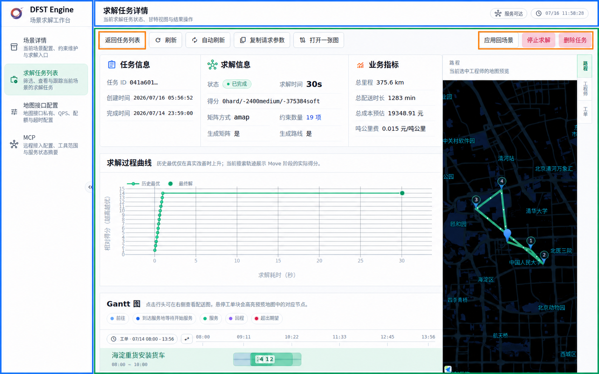

# Scenario UI 组件化现状说明

## 1. 当前组件化范围

当前 `scenario.html` 承载三个视图：

| 视图 | 组件内内容 |
| --- | --- |
| `create` | 场景字段、车辆/工程师、工单、SKU、地图选点、地址搜索、前端校验和创建求解抽屉。 |
| `result` | 求解结果摘要、Gantt、结果图表、路线、得分曲线、明细和结果内 tab。 |
| `map` | 一张图、路线回放、车辆状态和工单定位。 |

以下内容仍在 Engine 页面外：

* `#/solver-jobs` 任务列表及其筛选、轮询；
* 场景保存、生成在途矩阵、删除和导入求解请求；
* 停止求解、删除任务等 Engine 本地操作。

### 1.1 页面范围标注

绿色为 Scenario UI 组件；蓝色为 Engine Host 页面外壳或本地控制；橙色为 Engine Host 通过结果页 slot 注入的本地操作。

创建页中，顶部工具条由 Engine Host 提供；场景编辑区及其右侧边栏由组件渲染。Engine 通过 context 启用“场景概览”和“空闲车辆趋势”；右侧栏的收起、展开按钮也属于组件。Gateway 不启用这两个能力时，组件只展示全宽的中心编辑区。

场景编辑区的配置页签工具栏只展示页签和当前可用操作；当前页签内嵌信息图标。页签悬浮、键盘聚焦或点击时以本地化提示浮层显示当前页签说明，不在工具栏中常驻展开，以保持中英文界面的工具栏行高一致，并清晰表达提示与页签的绑定关系。

结果页截图使用已完成的求解任务，展示任务摘要、求解过程曲线、Gantt 和路线地图；橙框内的“返回任务列表”“停止求解”“删除任务”由 Engine Host 注入组件 slot。

结果摘要优先展示状态、Hard 可行性/得分、约束数量和求解耗时，再展示业务指标；矩阵模式、生成矩阵和生成路线直接置于左侧结果状态中，复用约束数量和求解耗时的两列 Key/Value 表格。任务 ID 是唯一允许视觉缩略的值，并通过悬浮和复制操作提供完整 ID；日期、状态、得分和业务指标不得以省略号误导。Hard / Medium / Soft 得分在同一行分段展示，Hard 罚分另有不只依赖颜色的危险提示。



## 2. 当前产物与源码

组件产物为：

```text
src/main/resources/META-INF/resources/static/scenario.html
```

`scenario.html` 由 `scripts/build-scenario-component.cjs` 生成，包含：

1. dependency manifest；
2. 业务 CSS 和组件补充 CSS；
3. `#scenario-root`；
4. 唯一的内联 `<script export>`。

组件 i18n 与 Engine i18n 独立维护。Scenario UI 的中英文词典和错误码词典由组件入口随该唯一内联脚本打包进 `scenario.html`，不读取或写入 Engine 的 `localStorage`，因此 Gateway 也可独立嵌入该组件。

组件第一方模板、动态状态和枚举均以组件语言包的语义化 `t(key, params)` 渲染；Engine Host 控件必须使用 Engine 自己的 key，不能复用组件词典。两种语言的 key 集合必须一致。源码原文匹配的 DOM 翻译器仅可在明确的遗留兼容根内启用，不能作为新 UI 或整个 Shadow Root 的默认翻译机制。

修改组件模板、入口脚本或样式后，在 `src/main/resources/META-INF/resources/static` 目录执行：

```bash
npm run build:css
npm run build:scenario
```

`build:css` 只更新 Engine 控制台页面使用的完整 CSS。`build:scenario` 会在构建期编译 Scenario UI 所需的 Tailwind 与业务 CSS，并直接内联到 `scenario.html`；不会生成组件专用的 `scenario-tailwind.compiled.css` 或 `scenario-business.compiled.css` 中间文件。

| 文件 | 当前职责 |
| --- | --- |
| `pages/scenario-detail.html` | 创建视图模板来源；构建时抽取中心工作区，以及可选的“场景概览”“空闲车辆趋势”右侧面板。 |
| `pages/solver-job-detail.html` | 结果视图模板来源；构建时移除标记为 `data-engine-local-control` 的按钮。 |
| `pages/solver-job-map.html` | 一张图模板来源；构建时移除标记为 `data-engine-local-control` 的按钮。 |
| `assets/js/scenario-component-entry.js` | 组合三个模板，维护当前 view、草稿和结果数据，并创建全局 bridge。 |
| `assets/js/utils/scenario-component-runtime.js` | 注册 custom element，加载 `scenario.html` 和依赖，创建 Shadow Root，执行导出脚本和清理生命周期。 |
| `assets/js/utils/scenario-component-engine-actions.js` | 将 Engine REST 适配为组件 actions。 |
| `pages/scenario-component.html` | Engine Host 页面模板，提供组件挂载点和组件外控制。 |
| `assets/js/pages/scenario-component-page.js` | Engine Host 的 Alpine Controller。 |

### 2.1 Engine Host 三个核心文件的关系

这三个文件组成 Engine 页面挂载组件的主链路：

```text
frameShell
  → 加载 pages/scenario-component.html
      → x-init="init()" 调用 scenario-component-page.js 的 Alpine Controller
          → 读取路由、构造 context 和 actions
          → scenario-component-runtime.js 的 mountScenarioComponent()
              → 创建 <vrp-scenario-ui-vrp0>、注入 context/actions
              → 加载 scenario.html、依赖和组件导出脚本
```

| 文件 | 在链路中的职责 | 与其他文件的关系 |
| --- | --- | --- |
| `pages/scenario-component.html` | Engine Host 的页面骨架，声明 `x-data="scenarioComponentPage"`、`x-init="init()"` 和组件挂载点 `$refs.component`；同时保留顶部工具条等组件外 UI。 | 由 `frameShell` 按 hash 加载；Alpine 初始化后调用 `scenario-component-page.js`。 |
| `assets/js/pages/scenario-component-page.js` | Alpine Controller，判断当前路由对应的 `view`，加载地图和业务上下文，创建 actions；接收组件事件，并在结果页注入 Engine 本地 slot 按钮。 | 从模板的 `init()` 进入；调用 Runtime 挂载组件并持有返回的元素实例。 |
| `assets/js/utils/scenario-component-runtime.js` | 通用组件 Runtime：派生 custom element tag，先注入 `context` 和 `actions` 再插入 DOM；负责读取 `scenario.html`、准备依赖、创建 Shadow Root 和执行组件生命周期。 | 被 `scenario-component-page.js` 的 `mountScenarioComponent()` 调用；加载构建产物 `scenario.html`。 |

`component_version` 当前只用于派生 custom element tag。Runtime 始终加载固定路径的 `scenario.html`。

## 3. Engine 页面加载关系

```text
index.html
  → init-alpine.js
  → frameShell 根据 hash 加载页面模板并执行 Alpine.initTree
      ├─ #/scenario        → pages/scenario-component.html → view=create
      ├─ #/solver-job?id=… → pages/scenario-component.html → view=result
      ├─ #/solver-map?id=… → pages/scenario-component.html → view=map
      └─ #/solver-jobs     → pages/solver-job-list.html

scenarioComponentPage.init()
  → loadMapContext() + engineScenarioActions()
  → mountScenarioComponent()
  → custom element connectedCallback()
      → 加载 scenario.html 和 registry.json
      → 准备依赖、写入 Shadow Root、执行 script export
      → scenarioComponentEntry 初始化当前 view
      → 触发 scenario-ready
```

`create` 在 `scenario-ready` 后读取 `/scenario` 并通过 `replaceScenarioDraft()` 回填。`result` 和 `map` 通过 `load_scenario_result` 读取任务数据。

组件发出 `scenario-navigate` 后，`scenario-component-page.js` 按 `target` 和可选导航意图更新 hash；`frameShell` 重新加载对应页面，旧组件随 DOM 移除执行清理。工单定位不使用 `sessionStorage`：结果页或一张图上报 `target="create"`、`intent="focus_ticket"` 和 `ticket_id`，Engine 在场景草稿回填后调用组件公开定位方法。

## 4. Component 与 Engine Host 的当前交互

### 4.1 context

Engine Host 挂载时传入以下 `context`。Gateway 与组件共享 `view`、`map_context`、`create_context`、`result_context` 等语义字段，但其挂载参数和任务标识来源由 Gateway 自行处理：

```js
{
  component_version: "vrp0",
  // 组件显示语言；只支持 zh-CN / en-US，缺失或非法值回退 zh-CN。
  locale: "zh-CN" | "en-US",
  view: "create" | "result" | "map",
  result_job_id: "...",
  map_context: {
    enabled: true,
    provider: "amap",
    browser_key: "...",
    js_url: "...",
    coordinate_system: "gcj02",
    locale: "zh-CN"
  },
  create_context: {
    request_schema: {},
    constraint_override_schema: {},
    constraint_override_defaults: {},
    scenario_persisted: false,
    draft: {
      revision: 1,
      expected_solve_duration: "PT30S",
      request_payload: {},
      constraint_overrides: {}
    }
  } | null,
  scenario_overview: true,
  available_agent_trend: true,
  result_context: object | null
}
```

关键字段的含义和用法如下：

| 字段 | 用法 | 当前约束 |
| --- | --- | --- |
| `component_version` | Engine Runtime 以其派生 custom element tag：`vrp-scenario-ui-${component_version}`。Engine 当前固定传入 `vrp0`。 | 仅用于 Engine 的 tag 派生，不用于选择 `scenario.html` 或加载不同版本的依赖；Gateway 的 tag 由 ImageVersion ID 派生，不依赖该 context 字段。 |
| `locale` | 组件的显示语言。Engine 初次挂载传入当前顶栏语言；Gateway 按自己的宿主语言传入。 | 仅支持 `zh-CN`、`en-US`；缺失或非法值回退 `zh-CN`。不持久化、不影响 API 请求，也不控制地图 SDK。Host 通过 `updateContext()` 单独更新该字段时，组件仅翻译当前视图，不重取结果、不替换草稿。 |
| `view` | 首次挂载时选择页面工厂：`create` 为场景编辑，`result` 为求解结果，`map` 为一张图。Host 根据自身路由传入对应值。 | Runtime 仅接受这三个值，其他值会报“Scenario UI view 不受支持”。`updateContext()` 只刷新当前视图的数据，切换视图应由 Host 更新路由并重新挂载组件。 |
| `result_job_id` | Host 可在 `result` 或 `map` 视图传入当前结果任务 ID；组件将它用于读取结果并在导航事件中回传。 | 可为空；组件也可从 `result_context.task.id` 或 `result_context.task.job_id` 派生。Gateway 的 URL 主键始终使用当前 Gateway Job ID，不使用该字段。 |
| `scenario_overview` | Engine 在创建视图传入该字段，要求组件展示场景概览。 | 可选；字段存在时展示。概览指标由组件从场景表格的响应式数据实时计算，不携带概览数据；Gateway 不传该字段。 |
| `available_agent_trend` | Engine 在创建视图传入该字段，要求组件在同一右侧栏展示空闲车辆趋势。 | 可选；字段存在时展示。组件通过 Host action 异步读取时间窗数据，Gateway 不传该字段。 |
| `map_context.browser_key` | 浏览器端 AMap JS SDK 的公开 key。地图功能加载时，组件将它编码后追加到 `map_context.js_url` 的 `key` 参数。 | Engine 从 `/quota` 的 `key` 读取；key 为空或读取失败时传入 `{ enabled: false, provider: "none" }`，组件不加载地图 SDK。该字段会暴露给浏览器，不能传服务端密钥。 |
| `map_context.locale` | 地图 SDK 的显示语言。 | 仅传给地图 SDK；不得用于推断或改变组件 `locale`。Engine Host 会把用户已选择的 Engine 语言显式投影到此字段；其他 Host 可以独立传值。HERE 原地替换底图语言图层；遗留 AMap 1.4 为同时保留原生 `darkblue` 主题与语言，会重建**地图 SDK 实例**并立即恢复同一业务结果、路线和 Marker。AMap 英文底图忽略 `darkblue` 时，仅对其底图层应用深色视觉兼容滤镜，不影响路线和业务 Marker。 |

当前行为：

* `request_schema`、`constraint_override_schema`、`constraint_override_defaults` 已传入但未被组件消费；
* 草稿 revision 与已处理 revision 相同时不重复导入；Runtime 不校验 revision 是否递增；
* `scenario_persisted=false` 时创建页禁用首次保存前的规划求解；
* 创建页不提供组件内“规划求解”按钮；Engine Host 通过公开的 `openPlanningDrawer()` 打开保留在组件内的求解参数抽屉并由组件提交，Gateway 保留自身创建按钮，读取、校验草稿后提交，不调用该方法；
* 右侧栏默认展开；点击组件内的按钮可收起为仅保留控制按钮的窄栏，宽屏下再次点击恢复 320px 宽度。该状态只保留在当前组件实例中，不写入 Host 或持久化存储；
* 结果页优先从 `result_context.engine_view.solver_job` 读取结果；没有 `result_context` 时调用结果 action；
* Runtime 只校验 view，不校验完整 context 结构；
* `scenario-context-updated` 会携带完整 context，不做字段过滤。

### 4.2 actions

`actions` 是 Engine Host 在组件挂载前注入的一组异步能力函数（接口/port），不是 REST 路径，也不是浏览器事件。调用方向是**组件 → Host**：组件提交“保存并求解”“地址解析”或“读取结果”等业务请求，Host 决定如何调用后端并把结果转换为统一格式。与之相对，`scenario-ready`、`scenario-navigate` 等 `CustomEvent` 的方向是**组件 → Host 的状态通知**。

正常集成路径中，组件通过 actions 请求 Host 能力，不依赖 Adapter 内部的 HTTP 细节；Engine Host 则保留后端调用、权限与错误处理的控制权。当前 Engine Host 通过 `engineScenarioActions()` 提供这些实现，并在元素插入前传给 `mountScenarioComponent()`。不过创建、地址和结果页面仍保留历史 Engine REST fallback：相应 action 缺失时会尝试直接调用 Engine REST，因此当前组件尚未完全脱离 Engine REST。

每个 action 都接收输入对象并异步返回 `{ ok: true, data }` 或 `{ ok: false, error }`。失败时 `error` 至少提供稳定的 `{ code, params }`，分别对应 REST `error_code`、`error_params`；组件按自身 `context.locale` 本地化，不直接展示服务端 `message`。组件依据该结果更新自身界面，不直接依赖 Adapter 内部的 HTTP 细节。

| Action | 组件中的用途 | Engine Adapter 当前调用 |
| --- | --- | --- |
| `submit_scenario` | 创建页在用户确认“规划求解”后提交当前草稿；用于保存场景并发起一次求解。输入包括 `request_payload`、`expected_solve_duration` 和提交后的导航偏好。 | 先 `PUT /scenario`，再 `POST /solver_job`；根据草稿 options 传递在途矩阵、矩阵模式和路线绘制参数。 |
| `resolve_coordinate_address` | 创建页的地图选点或坐标录入后，批量将经纬度反查为可显示的地址和行政区信息。 | 对每个有效坐标调用 `/pois/regeocode`，逐点返回已解析、未找到或 provider 失败状态。 |
| `search_text_address` | 创建页地址搜索时，将用户输入的关键词和可选城市提示转换为可选地址候选项。 | 调用 `/pois/geocode`，过滤无坐标项，并将候选数限制在 1–20 个。 |
| `load_available_agent_windows` | 创建页右侧“空闲车辆趋势”刷新时读取可用工程师时间窗。 | 调用 `/scenario/available_agents`；组件只在 `available_agent_trend` 存在时调用。 |
| `load_scenario_result` | `result`、`map` 视图首次加载或刷新时读取任务结果，作为摘要、图表、路线和一张图的展示输入。 | 有 `job_id` 时调用 `/solver_job/{id}?remove_virtual=true`，否则调用 `/solver_job?remove_virtual=true`。 |

Action 返回 `{ ok: true, data }` 或 `{ ok: false, error }`。当前 Engine Adapter 将请求异常转换为 `ok: false`。Gateway 必须注入其需要的 action，不能依赖上述 Engine REST fallback。

### 4.3 事件、实例方法与 slot

所有事件均为可冒泡、可跨 Shadow DOM 边界的 `CustomEvent`。各事件的用途如下：

| 事件 | 用途 | 关键 `detail` |
| --- | --- | --- |
| `scenario-ready` | 组件已完成依赖准备、Shadow DOM 渲染和初始化。Engine 以此为时机回填创建页草稿，或在结果页注入本地 slot 按钮。 | 无。 |
| `scenario-error` | 上报组件加载、依赖准备、上下文更新或页面处理失败。Host 可据此显示错误提示。 | `code`、`params`、按组件 locale 生成的 `message`；Host 应优先按 `code`、`params` 本地化，不展示 REST 原始 `message`。 |
| `scenario-context-updated` | Host 调用 `updateContext()` 后通知上下文已交给组件处理；不代表视图已切换或所有数据加载成功。 | `context`。 |
| `scenario-dirty-state-changed` | 创建页草稿变为已修改或恢复未修改时通知 Host；可用于离页提醒或同步 Host 的保存状态。 | `dirty`、`changed_at`。 |
| `scenario-create-readiness-changed` | 创建页前端校验出的“可尝试规划求解”状态改变时通知 Host；不替代后端校验。 | `ready`、`changed_at`。 |
| `scenario-draft-imported` | 创建页导入某个 draft revision 后报告成功或失败，便于 Host 确认草稿回填结果。 | `revision`、`accepted`、`message`、`field_errors`。 |
| `scenario-result-state-changed` | 结果页首次加载及每次刷新完成后，把当前结果状态通知 Host；加载失败或没有任务时也会发出空状态，便于 Host 默认禁用本地结果操作。 | `{ job_id: string | null, status: string | null }`。 |
| `scenario-navigate` | 组件请求 Host 处理跨页面导航。Engine 映射到 `#/scenario`、`#/solver-job?id=…`、`#/solver-map?id=…`；Gateway 映射到 `#/create`、`#/jobs/{id}`、`#/jobs/{id}?view=map`，并重新挂载对应 view。工单定位时，Gateway 额外写入 `source_job_id`。 | `target` 为 `create`、`result` 或 `map`；已知结果任务时携带 `result_job_id`，未提供时 Host 保留当前任务；`intent="focus_ticket"` 时必须携带 `ticket_id`；不含 `route`。 |

| 类型 | 当前内容 |
| --- | --- |
| 创建页方法 | `validateScenarioDraft()`、`getScenarioDraft()`、`applyScenarioValidationErrors()`、`clearScenarioValidationErrors()`、`replaceScenarioDraft()`、`openPlanningDrawer()`、`focusScenarioTicket(ticketId)`、`refreshAvailableAgentTrend()`、`clearAvailableAgentTrend()`。`focusScenarioTicket(ticketId)` 返回 `{ ticket_id, focused }`，仅定位现有工单，不修改草稿；后两个方法由 Engine 在草稿载入、保存、生成矩阵或删除后刷新、清空趋势数据。 |
| 结果方法 | `refreshScenarioResult()`、`getScenarioResult()`。 |
| 结果页 slot | `engine-result-toolbar-start`、`engine-result-actions`。 |

结果模板中的 Engine 本地按钮在构建时移除。Engine Host 在 `scenario-ready` 后向上述 slot 追加“返回任务列表”“停止求解”“删除任务”按钮，并监听 `scenario-result-state-changed`：只有 `SOLVING_SCHEDULED`、`SOLVING_ACTIVE` 且存在任务 ID 时启用停止；只有 `SOLVING_FINISHED`、`ERROR` 且存在任务 ID 时启用删除；加载失败或无任务时两项全部禁用。任务详情不提供“应用回场景”按钮。

## 5. Engine Host 当前职责

`scenario-component-page.js` 当前负责：

* 根据 hash 设置 `create`、`result`、`map` view；
* 调用 `/quota` 读取地图配置并构造 `map_context`；
* 创建 `engineScenarioActions()` 并挂载组件；
* 创建页就绪后读取 `/scenario` 并回填草稿；
* 创建页读取到地图服务不一致错误时，在 Host 顶部显示清除并重建场景的引导；
* 处理保存场景、生成在途矩阵、删除场景、导入求解请求；
* 结果页就绪后注入 Engine 本地按钮；
* 监听结果状态事件并同步注入按钮的启用状态；
* 接收 `scenario-navigate`，将 `create` 映射为 `#/scenario`，将 `result`、`map` 映射为 `#/solver-job?id={result_job_id}`、`#/solver-map?id={result_job_id}`；收到 `focus_ticket` 时将工单号作为一次性 `focus_ticket` 路由参数传入场景页，草稿加载后调用 `focusScenarioTicket()` 并清除该参数。

`frameShell` 当前负责根据 hash 获取 `pages/*.html`，写入页面容器并初始化 Alpine。

## 6. 当前运行时、依赖与限制

组件 manifest 当前声明以下依赖：

| 依赖 | 使用范围 |
| --- | --- |
| Alpine `3.15.3` | Host 全局前提。 |
| Material Symbols Rounded `2026-06-v1` | 所有组件 view。 |
| Tailwind CSS `4.1.18` | 仅组件构建期使用；编译结果随 `scenario.html` 交付，不在 manifest 中声明，也不由 Host 提供。 |
| Plotly Basic `3.3.1` | `result` view。 |

Runtime 从 `assets/scenario-runtime/registry.json` 加载 manifest 声明的 Host 公共依赖；Material Symbols stylesheet 和 Plotly script 入口通过 SRI 加载。Tailwind 编译 CSS 已在 `scenario.html` 的 `<style>` 中，运行时不会请求或注入私有 Tailwind CSS。构建与校验脚本使用 registry 中的 SHA-256 检查 Host 依赖文件。

组件专用 CSS 的构建路径为 `scenario-tailwind.source.css`、`scenario-business.source.css` → 构建进程内存 → `scenario.html` 的 `<style>`。只有生成后的 `scenario.html` 作为可部署产物提交 Git；源样式保留在源码中，组件专用编译中间文件不生成也不提交。

当前运行限制：

* 组件页面通过全局 `window.VrpScenarioGateway` 传递 bridge，同一页面只挂载一个组件实例；
* `updateContext()` 只更新当前 view；Engine 和 Gateway 都通过各自 hash 路由重新挂载组件切换 view。Gateway 的一张图 URL 为 `#/jobs/{id}?view=map`，旧 `#/jobs/{id}/map` 会重定向到该 URL；
* Host 更新 `context.locale`，或仅同步更新 `map_context.locale` 时，组件保留当前草稿和结果；前者更新 Shadow DOM 文案，后者更新地图 SDK 的底图标签语言。HERE 原地更新图层；AMap 1.4 为避免 `setLang()` 重载底图后丢失原生 `darkblue` 主题，重建地图 SDK 实例并立即重绘相同路线和 Marker；若 AMap 英文瓦片仍忽略主题，仅底图层使用深色兼容滤镜；
* 地图 SDK 不在 registry 中。`map_context.enabled=true` 时，组件从 `map_context.js_url` 动态加载 AMap 或 HERE SDK，并将相应 SDK 样式复制到 Shadow Root；
* Engine Host 当前从 `/quota` 读取 `key` 填入 `map_context.browser_key`；`/quota` 同时返回服务端配置；
* 组件页面仍会读取 hash 上下文，并使用 `window`、`document`，且保留 Engine REST 兜底调用；跨页面导航只通过不含 `route` 的 `scenario-navigate` 事件请求 Host 处理，工单定位不使用 `sessionStorage`；
* Shadow DOM 用于 DOM 和样式封装，不是安全沙箱。

## 7. 当前构建与验证

在静态资源目录执行：

```bash
npm run build:css
npm run build:scenario
npm run verify:scenario
npm run test:scenario-import
npm run test:solver-job-list
npm run test:scenario-solve
npm run test:score-progress
npm run test:i18n
```

当前自动化验证：

* `verify:scenario`：产物结构、依赖注册表、页面边界和结果/地图模板关键片段；
* `test:scenario-import`：草稿导入；
* `test:solver-job-list`：任务列表筛选和轮询；
* `test:scenario-solve`：首次保存前的提交限制、Engine action 提交、右侧概览/趋势的 context 开关、趋势 action 及右栏收起状态；
* `test:score-progress`：得分曲线数据处理。
* `test:i18n`：Engine locale 默认值/持久化、错误码参数本地化、未知错误不泄露服务端消息，以及 `scenario.html` 的组件语言包内联。
* `test:i18n-ui`：Playwright 以英文 locale 挂载 Engine Host 与 Scenario Shadow DOM，验证 Host/组件关键文案、动态趋势标签、结果页，以及一张图的回放工具栏、时间轴和工程师状态面板；语言切换后组件不重建。
